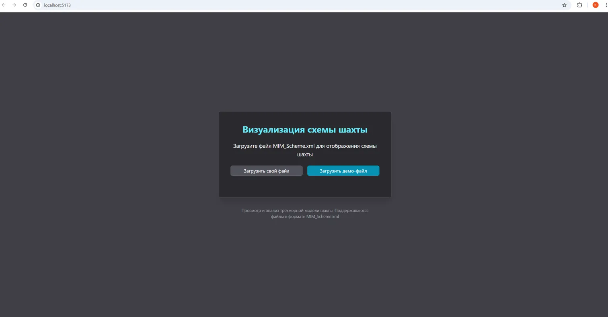
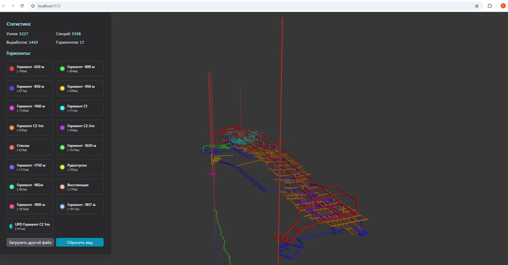

# Визуализация схемы шахты

Интерактивное веб-приложение для просмотра и анализа трёхмерных моделей шахт на основе файлов MIM_Scheme.xml.




## Описание

Приложение позволяет загружать файлы MIM_Scheme.xml, содержащие данные о структуре шахты, и визуализировать их в трехмерном пространстве. Пользователь может исследовать трехмерную модель шахты, просматривать статистику и информацию о различных горизонтах.

### Основные возможности

- Загрузка файлов MIM_Scheme.xml (поддержка кодировки Windows-1251)
- Загрузка демонстрационного файла для ознакомления с функционалом
- Интерактивная 3D-визуализация шахты с использованием Three.js
- Отображение статистики (количество узлов, секций, выработок, горизонтов)
- Отображение списка горизонтов с цветовой маркировкой
- Навигация и масштабирование в 3D-пространстве
- Возможность сброса вида камеры к исходному положению

## Технический стек

- **React** - основной фреймворк для построения пользовательского интерфейса
- **TypeScript** - типизированный JavaScript для улучшения качества кода
- **MobX** - библиотека для управления состоянием приложения
- **Three.js** - библиотека для отображения 3D-графики в браузере
- **Tailwind CSS** - фреймворк для быстрой стилизации компонентов

## Архитектура проекта

### Компоненты

- **MineVisualization** - корневой компонент, управляющий переключением между загрузкой файла и 3D-визуализацией
- **FileUploader** - компонент для загрузки файлов MIM_Scheme.xml
- **MineRenderer** - компонент для отображения 3D-модели шахты
- **MineControls** - панель управления с информацией и элементами управления
- **MineStatistics** - отображение статистики по загруженной модели
- **HorizonsList** - отображение списка горизонтов с цветовой маркировкой

### Хуки и утилиты

- **useThreeScene** - хук для инициализации и управления сценой Three.js
- **useCreateMineModel** - хук для создания и обновления 3D-модели шахты
- **xmlParser** - утилиты для разбора файлов XML и извлечения данных о шахте
- **threeHelpers** - вспомогательные функции для работы с Three.js
- **threeCleanup** - утилиты для корректного освобождения ресурсов Three.js

### Хранилище данных (MobX)

- **MineStore** - хранилище данных о шахте и состоянии приложения
- **StoreContext** - React-контекст для доступа к хранилищу из компонентов

### Структура данных шахты

- **Горизонты (Horizons)** - уровни шахты на определенной высоте
- **Секции (Sections)** - сегменты тоннелей, соединяющие два узла
- **Узлы (Nodes)** - точки в 3D-пространстве с координатами
- **Выработки (Excavations)** - группы секций, образующие логические единицы (тоннели, штреки и т.д.)

## Начало работы

### Установка зависимостей

```bash
npm install
```

### Запуск в режиме разработки

```bash
npm run dev
```

Приложение будет доступно по адресу: http://localhost:5173

### Сборка проекта

```bash
npm run build
```

### Запуск собранной версии

```bash
npm run preview
```

## Использование приложения

1. **Загрузка файла**
    - Нажмите кнопку "Загрузить свой файл" для выбора и загрузки файла MIM_Scheme.xml
    - Или нажмите "Загрузить демо-файл" для загрузки демонстрационного файла

2. **Просмотр 3D-модели**
    - Используйте мышь для вращения камеры (левая кнопка)
    - Прокрутка колеса мыши - изменение масштаба
    - Правая кнопка мыши - перемещение камеры

3. **Управление видом**
    - Кнопка "Сбросить вид" возвращает камеру в исходное положение
    - Кнопка "Загрузить другой файл" возвращает к экрану загрузки

4. **Просмотр информации**
    - Слева отображается статистика о количестве элементов в модели
    - Список горизонтов с цветовой маркировкой позволяет идентифицировать различные уровни шахты

## Структура кода

```
src/
├── components/            # React-компоненты
│   ├── mine/              # Компоненты для визуализации шахты
│   │   ├── MineControls.tsx
│   │   ├── MineModel.tsx
│   │   ├── MineStatistics.tsx
│   │   └── HorizonsList.tsx
│   ├── ui/                # UI компоненты
│   │   └── Button.tsx     # Переиспользуемый компонент кнопки
│   ├── FileUploader.tsx   # Компонент загрузки файла
│   ├── MineRenderer.tsx   # Компонент 3D-рендеринга
│   └── MineVisualization.tsx # Корневой компонент визуализации
├── hooks/                 # Пользовательские React-хуки
│   ├── useCreateMineModel.ts
│   └── useThreeScene.ts
├── models/                # Типы и интерфейсы
│   └── types.ts
├── store/                 # MobX-хранилища
│   ├── MineStore.ts
│   └── StoreContext.tsx
├── utils/                 # Утилиты и вспомогательные функции
│   ├── threeCleanup.ts    # Очистка ресурсов Three.js
│   ├── threeHelpers.ts    # Вспомогательные функции для Three.js
│   └── xmlParser.ts       # Парсинг XML-файлов
├── App.tsx                # Корневой компонент приложения
└── main.tsx               # Точка входа в приложение
```

## Лицензия

MIT